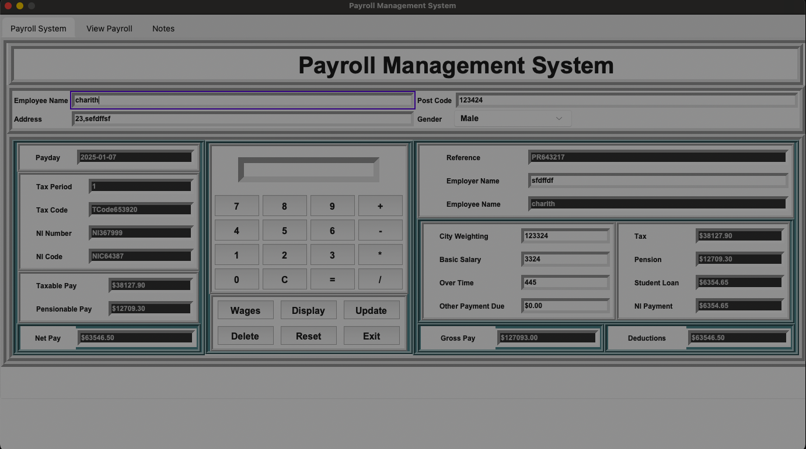
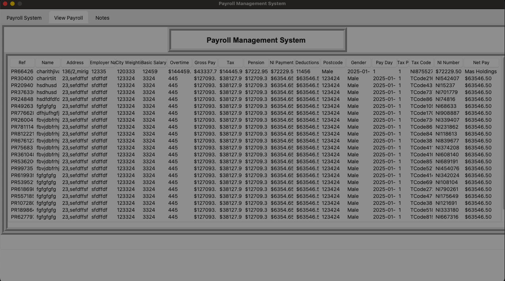
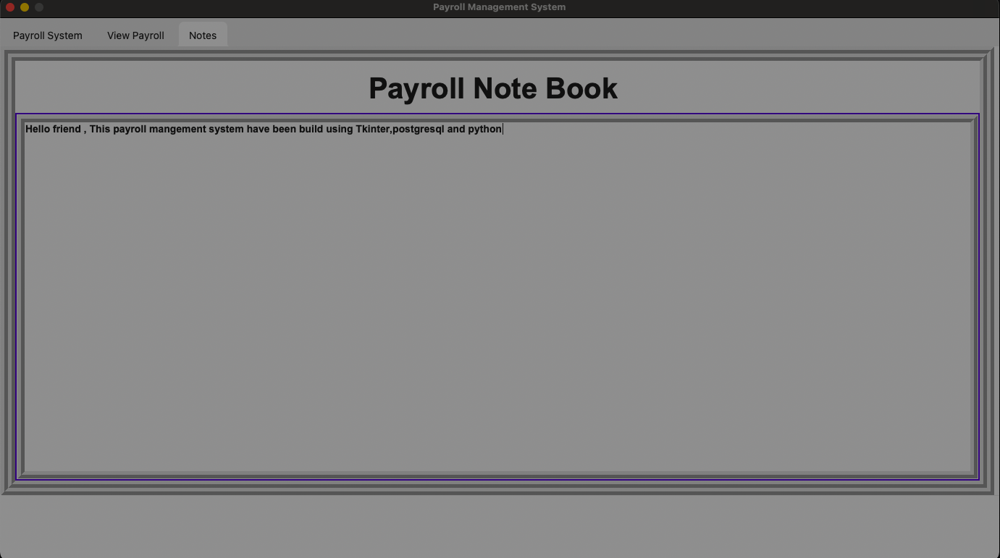

# Payroll management System

## Description

This is a payroll management system that allows you to manage your payroll. It has a database of employees and their payrolls. It has a GUI that allows you to add, update, and delete employees.

## Preparation
    
1. first you need to setup a  postgresql database.
2. you have to create a database called "payroll".
3. Change the database connection parameters in the code to connect to your database. (ex: database="payroll", user="", password="", host="localhost", port="5432")
3. you have to create a table called "payment" use the following command:

```
CREATE TABLE
  public.payment (
    ref character varying(255) NOT NULL,
    fullname character varying(255) NULL,
    address character varying(255) NULL,
    cityweighting character varying(255) NULL,
    basicsalary character varying(255) NULL,
    overtime character varying(255) NULL,
    grosspay character varying(255) NULL,
    tax character varying(255) NULL,
    pension character varying(255) NULL,
    nipayment character varying(255) NULL,
    deductions character varying(255) NULL,
    postcode character varying(255) NULL,
    gender character varying(255) NULL,
    payday character varying(255) NULL,
    taxperiod character varying(255) NULL,
    taxcode character varying(255) NULL,
    ninumber character varying(255) NULL,
    netpay character varying(255) NULL,
    employername character varying(255) NULL
  );

ALTER TABLE
  public.payment
ADD
  CONSTRAINT payment_pkey PRIMARY KEY (ref)
```
To Run the Payroll Management System, run the following command:

```bash
uv sync
source .venv/bin/activate
uv run main.py
```

  

  


